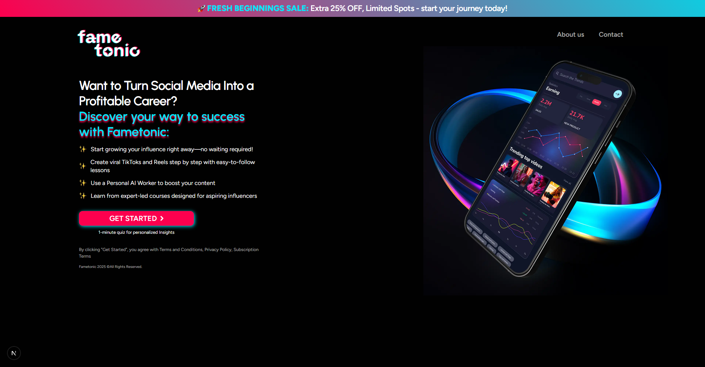

# Fame Tonic

A responsive, pixel-perfect frontend implementation converted from a Figma design into a **Next.js** application with **Tailwind CSS**.  
The goal of this project is to showcase the process of turning static Figma UI designs into fully functional, production-ready web pages.

---

## 🚀 Features

- **Pixel-perfect design** — matches the original Figma layout precisely  
- **Responsive layout** — works seamlessly on mobile, tablet, and desktop  
- **Next.js framework** — for performance, SEO, and server-side rendering  
- **Tailwind CSS** — utility-first styling with minimal custom CSS  
- **Optimized assets** — compressed images and lazy loading  
- **Reusable components** — maintainable and scalable code structure  

---

## 📦 Tech Stack

- **Framework:** [Next.js](https://nextjs.org/)  
- **Styling:** [Tailwind CSS](https://tailwindcss.com/)  
- **Deployment:** Netlify

---

## 🛠 Installation & Setup

1. **Clone the repository**
   ```bash
   git clone https://github.com/Imtious-coder/Fame_Tonic.git
   cd Fame_Tonic
   
   npm install
   # or
   yarn install
   
   npm run dev
   # or
   yarn dev

   http://localhost:3000

| Desktop View                                      | Mobile View                                     |
| ------------------------------------------------- | ----------------------------------------------- |
|  |  |


###### Imtious Islam